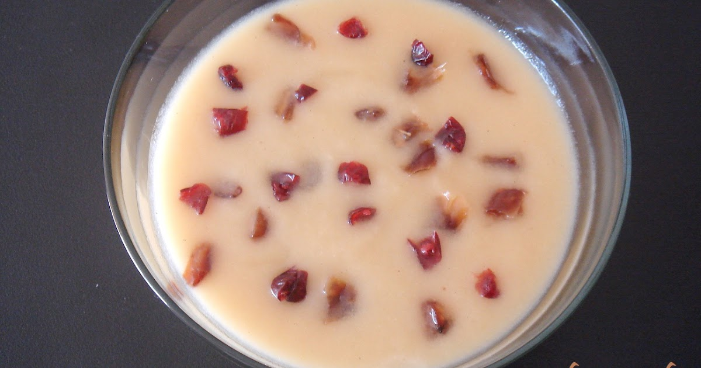

Last week we went for apple picking, it was great fun!. Today I share a yummy recipe with all of you. Whether you like it or not, I am sure you kids will like it a lot.

### What you need
- Apples - 3 peeled and roughtly chopped
- Chowari - 1/2 cup
- Water - 1 cup
- Milk - 1/2 gallon
- Sugar - 5 tbl spoon
- Condensed Milk - 1/2 cup
- Ghee - 1 tbl spoon
- Raisins 10
- Cardamom powder 1/4 tbl spoon

### How to prepare

 Slightly fry the cut apples in a pan with a spoon of ghee. In another pan cook chowari and keep it aside. Boil the milk along with sugar. When the milk comes to a boil, add the cooked chowari and the fried apple pieces and allow it to cook for some time. Add condensed milk and stir it continuously. Sprinkle the raisins fried in ghee and cardamom powder.

Thats all, serve hot!. Enjoy!

