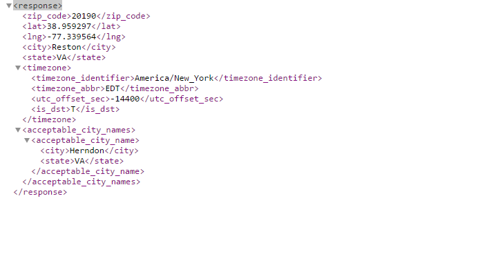
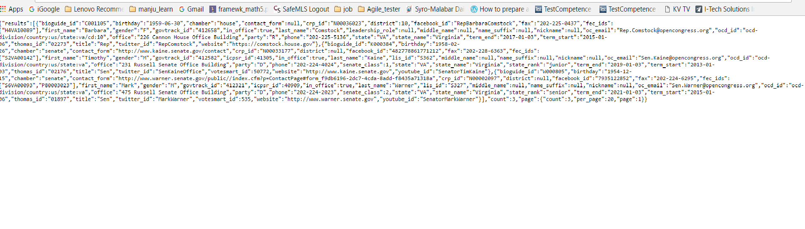
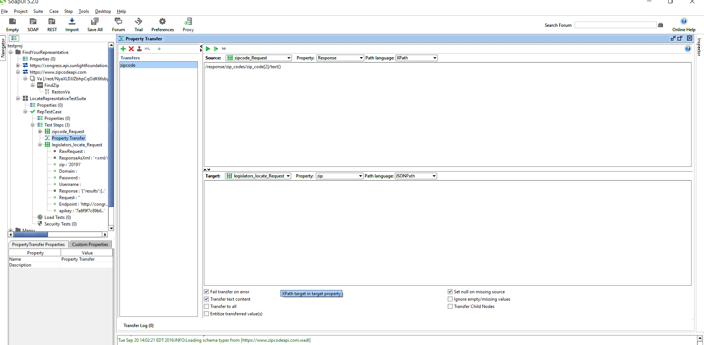
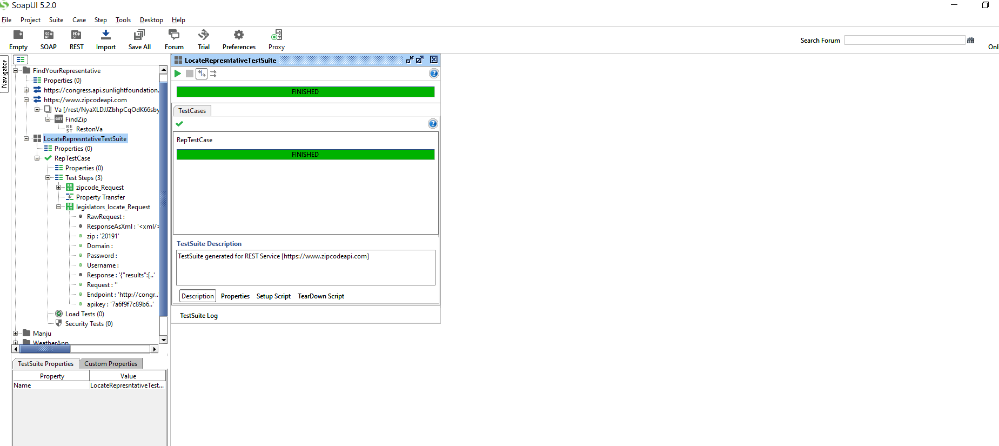

Internet of MicroServices is the backbone on which IOT stands. Amazon Echo playing music from your album or Camera uploading the photos you take directly to Google Photos etc. <!-- more --> When you make an order in Amazon, the ordering system will ask the Inventory system to hold the items, and when payment is made it will ask shipping system to process the shipment. Well, testing this fictitious Amazon servies is not in scope. In this post I will show how SoapUI can be used to orchestrate two dispirate RESTful webservice.

###  The plot
Find the Congressman of your city. For this we will use two publically available service.
 - [ZipcodeAPI](https://www.zipcodeapi.com) - Has web service endpoints that can return the zip codes within a city.
 - [Sunlight Lbs](https://sunlightlabs.github.io/congress/index.html) A web service endpoint that can locate the senator based upon zip code.
The idea is to first identify the zip codes in a city and then use these zipcode to figure out the current senator.

### Accessing the APIs Manually
Let's first test these manually and see how it is functioning. But, before we begin we should register for an API key by visiting the "[Register for API key](http://www.zipcodeapi.com/API#zipToLoc)". The API key that I have got after registering is `pz3mr83JCdfPe0BRtKFerVBplteECsq21totCsceFs4TsFLVqqaRlLhHfwlSYMU0`.
 In the sample request below, I passed zipcode as the parameter and in the json Chantilly, VA can be seen.
    ```bash
    http://www.zipcodeapi.com/rest/pz3mr83JCdfPe0BRtKFerVBplteECsq21totCsceFs4TsFLVqqaRlLhHfwlSYMU0/multi-info.json/20152/degrees```
  
   

 Next lets use [sunlightlabs] (https://sunlightlabs.github.io/congress/index.html). In order to access the service, we need to obtain an [API key](http://sunlightfoundation.com/api/accounts/register/). Shown below a sample request and the corresponding result
 `https://sunlightlabs.github.io/congress/index.html/legislators/locate/?zip=xxxx&apikey=xxxxx`
    
  
  
### Testing using RESTAPI service
Now lets look into how we can perform the above using SoapUI.
 Step1 :Add a REST request to the zipcodeapi webservice endpoint.ie https://www.zipcodeapi.com/rest/apikey/city-zips.xml/CITY-NAME/STATE.
 
 Step 2 : Add a REST request to Sunlight congress API  endpoint. i.e https://sunlightlabs.github.io/congress/index.html/legislators/locate/?zip=xxxx&apikey=xxxxx

 Step 3 :Create a test suite add include the above two request to a TestCase.

 Step 4 : Add property transfer step between these REST calls to transfer the `zip code` from zipcodeapi XML response and add it to sunlightlabs request. [Property Transfer](https://www.soapui.org/functional-testing/teststep-reference/property-transfers.html) enables us to transfer the values from one step to another. The picture below shows how I have configured the property transfer step.
    

 Step 5 : Add a few assertions on every REST request.

 Step 6 : Run the TestSuite and check the result

   


I have shared the entire SoapUI project in [soapui_findyourrep](https://github.com/manjupaul/soapui_findyourrep) repository.


  
  
  
  
  
 