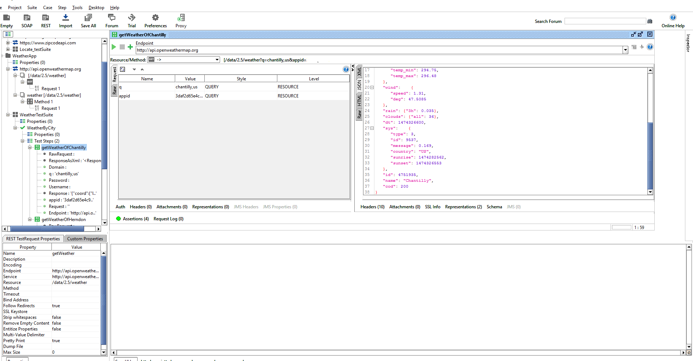
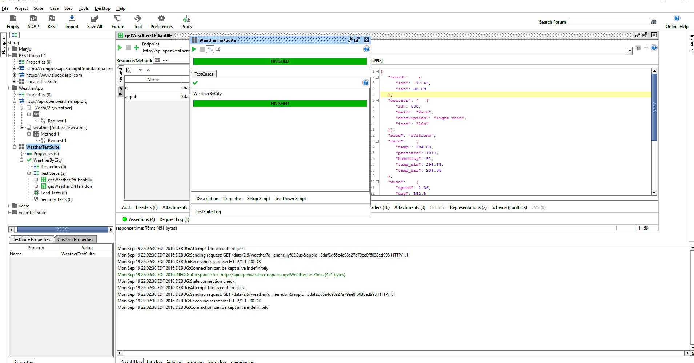

In this post I am going to test a webservice using SOAPUI REST service.
Here I am using a webservice named current weather data .

Step 1: Singn on https://home.openweathermap.org/ and get the API key.

 
Step 2: Goto http://openweathermap.org/current.
Pass the parameter city name by manualy and check what will it return

Example - api.openweathermap.org/data/2.5/weather?q=chantilly,us&appid=xxxxxx

 Choose the Call current weather data by city name
         API call : api.openweathermap.org/data/2.5/weather?q={city name},{country code}
        Example - api.openweathermap.org/data/2.5/weather?q=chantilly,us&appid=xxxxxx
         
Step 3: Click on Create REST project and add the URL = http://api.openweathermap.org/data/2.5/weather?q=Chantilly,us&appid=xxxxxx

Step 4: Create a TestSuite ,after that add TestCase and add TestSteps 
 
Choose the GET request, we will get the  data based on parameter we passed.

Now you can see a nicely formatted JSON response in the JSON view 

Step 5: Add the following assertion to validate the content of the response.

1.Specify JSONpath expression to check the Longitude and Latitude are valid or not.
2.JSON path match valid or not
3.Specify JSONpath existance match valid or not

        
The working project is available in this [repository](https://github.com/manjupaul/soapui_weatherapp) 
        

 

